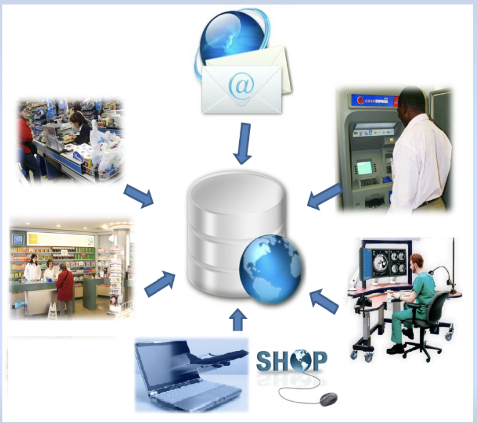
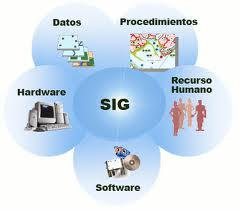
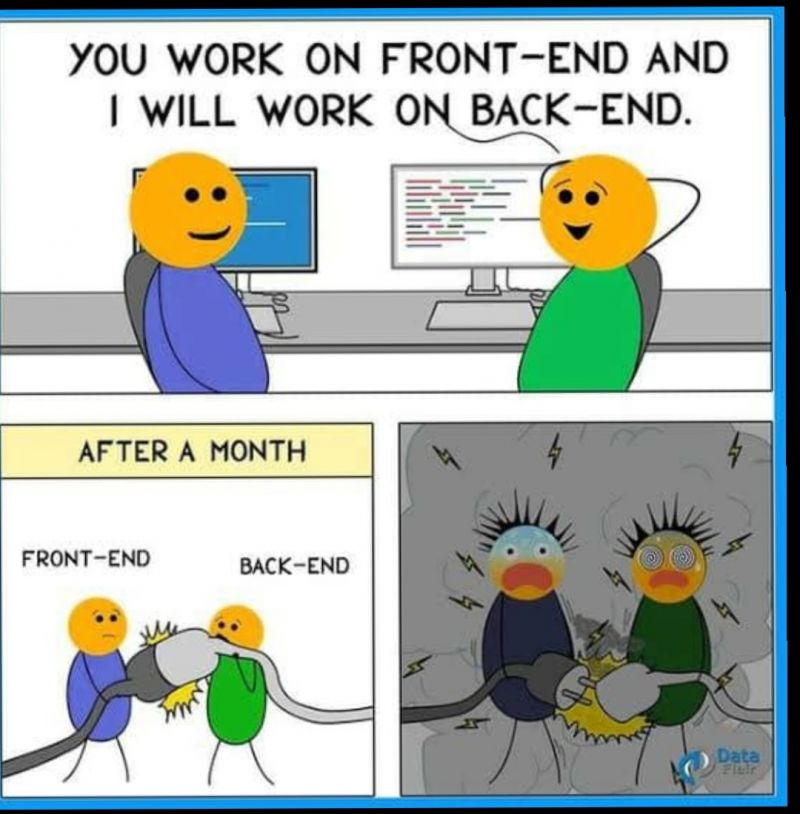
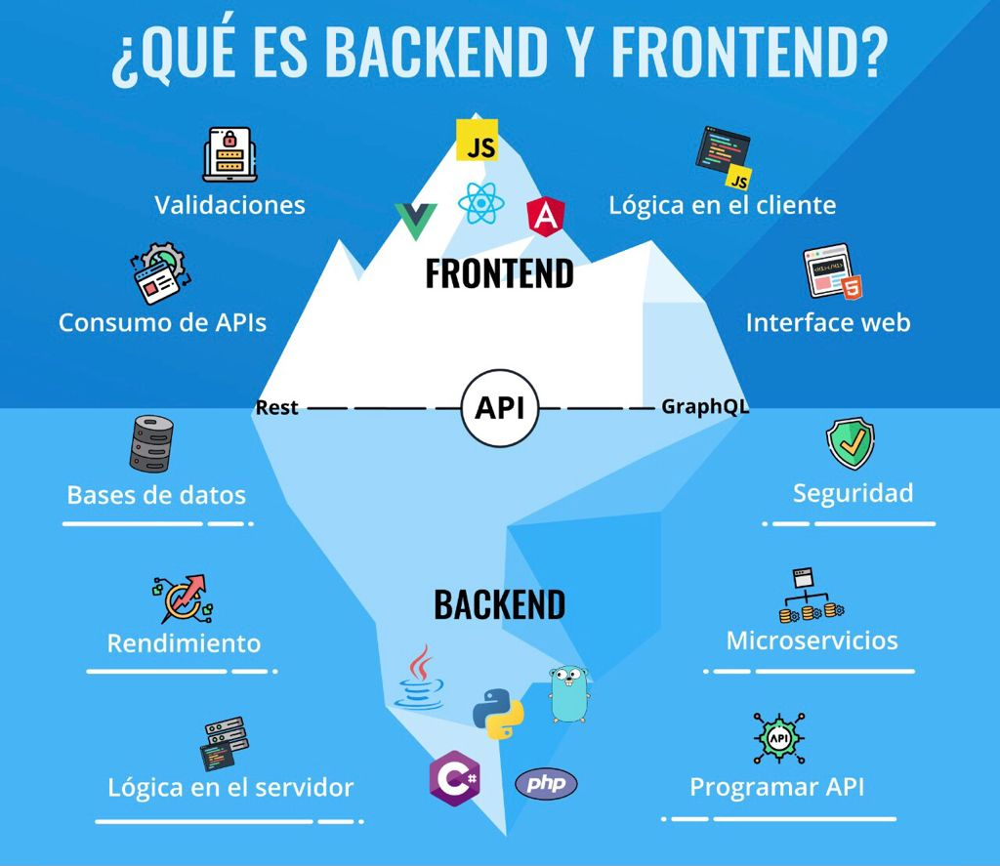
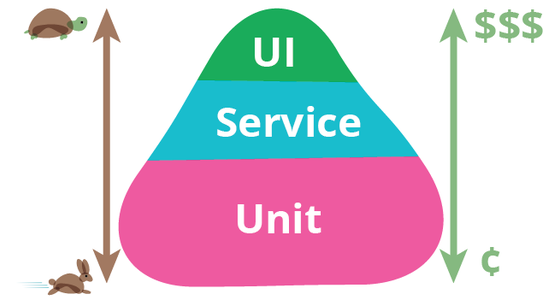
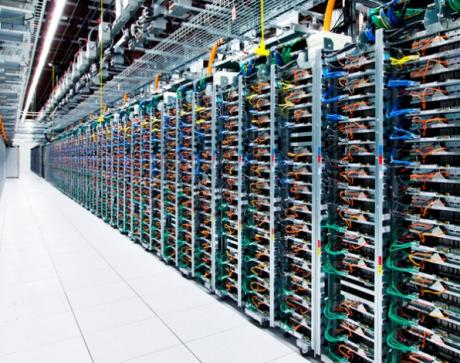

# Programación web

## Sistema de Información

* **Elementos**:

  

## Etapas en el desarrollo de un proyecto web

1. **Planificación**
1. **UX/UI**
1. **Desarrollo**
1. **Despliegue**
1. **Soporte**

    

## Desarrollo Web

Dar soluciones efectivas y creativas a los problemas que surjan en el ámbito laboral en beneficio de la sociedad en su conjunto

## QA Automation

Pone entre el tester y la aplicación de software un programa diseñado para controlar la ejecución de pruebas, y comparar de manera más rápida los resultados obtenidos y los resultados esperados

## Despliegue

Es el proceso de llevar los cambios o nuevas funcionalidades de los equipos locales (de los desarrolladores) al **ambiente de producción** (el que usan los usuarios finales)

## Proyectos desarrollados en Programación Web 2

| Títulos | Alumnos | URLs |
| -- | -- | -- |
| Gestión de Turnos | Matias Coria | [https://gestiondeturnos.onrender.com/index.html](https://gestiondeturnos.onrender.com/index.html) |
| E-commerce de Indumentaria | Ezequiel Fidalgo | [https://luvanay-frontend.onrender.com/womens](https://luvanay-frontend.onrender.com/womens) |
| Gestión de comentarios a CV online | Nicolas Agnessi Vuelta | [https://app-comentarios.onrender.com/](https://app-comentarios.onrender.com/) |
| Sistema de registro de buques de interés | Marcelo Hernandez | [https://final-iy62.onrender.com/](https://final-iy62.onrender.com/) |

 
 

---

 <a href="a11y.md">Accesibilidad Web ></a>

